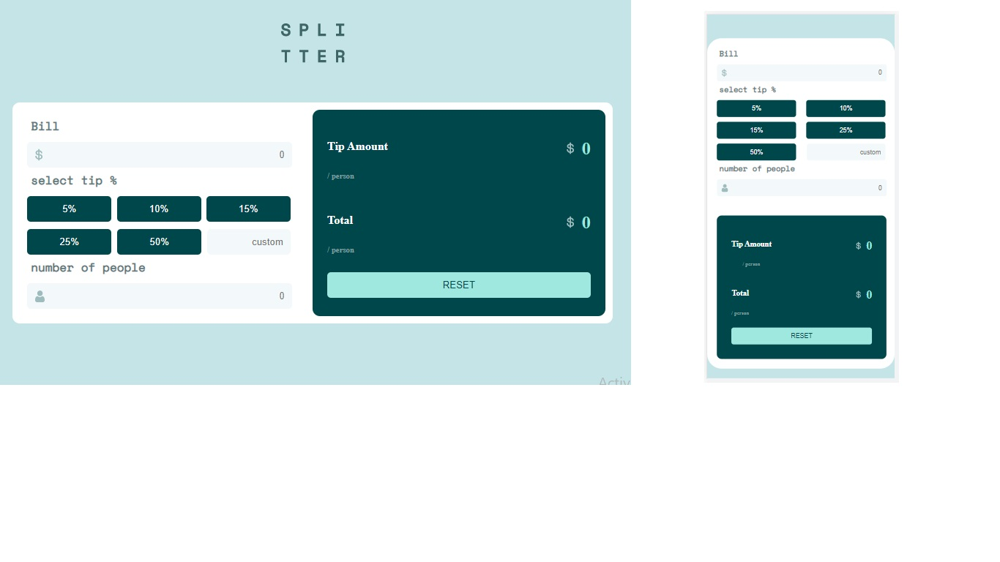

# Frontend Mentor - Tip calculator app solution

This is a solution to the [Tip calculator app challenge on Frontend Mentor](https://www.frontendmentor.io/challenges/tip-calculator-app-ugJNGbJUX). Frontend Mentor challenges help you improve your coding skills by building realistic projects.

## Table of contents

- [Overview](#overview)
  - [The challenge](#the-challenge)
   - [Screenshot](#screenshot)
     - [Links](#links)
   - [Built with](#built-with)
  - [What I learned](#what-i-learned)

## Overview
Creating a form of reward for each person
### The challenge

Users should be able to:

- View the optimal layout for the app depending on their device's screen size
- See hover states for all interactive elements on the page
- Calculate the correct tip and total cost of the bill per person

### Screenshot

### Links

- Live Site URL: [Add live site URL here](https://maryametesami.github.io/Calculator--pr/)

### Built with

- Semantic HTML5 markup
- CSS custom properties
- javascript

### What I learned

The correct way to work with forms and its limited validation

